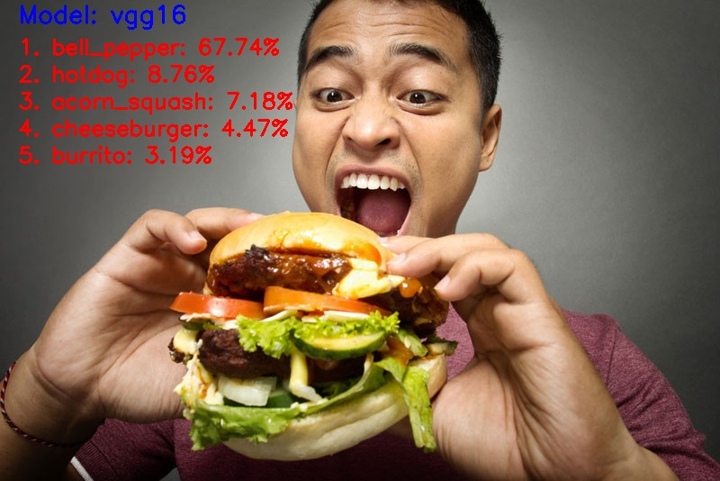
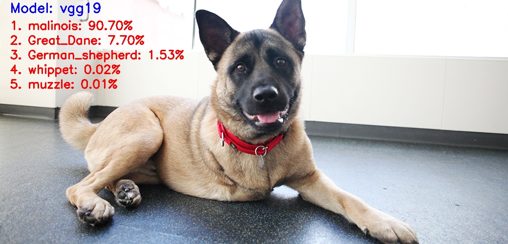
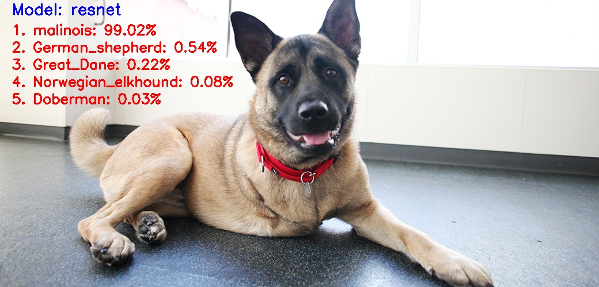

# Image-Classification-ImageNet-VGGNet-ResNet-Inception-Xception-with-Keras

## Classifying an image and showing the predicted image
>python classify_image.py --model vgg16 --image images/test1.jpg 

## Classifying an image, showing the predicted image and saving the predicted image to the destination folder
>python classify_image.py --model vgg16 --image images/test1.jpg --output output_result_image/vgg16_output/vgg16_test1_output.jpg

## Available models on --model parameter
- VGG16: "--model vgg16"
- VGG19: "--model vgg19"
- InceptionV3: "--model inception"
- Xception: "--model xception"
- ResNet50: "--model resnet"

# Classified Images

## VGG16

## VGG19

## ResNet

## Inception

## Exception

